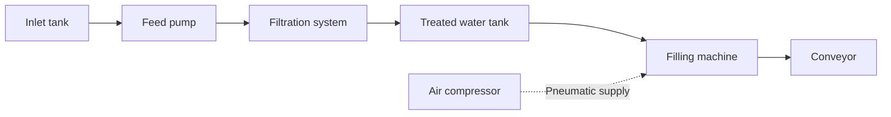

# Industrial Alarm Dataset Contract

## Scope and Industrial Process

The source represents a fictional water treatment and bottling plant named
AquaLine, with one production line and one SCADA export source (`SCADA_01`).
All names, thresholds, priorities, and event patterns are synthetic assumptions
for this exercise, not engineering specifications or evidence of regulatory compliance.



The compressor supports the same production line but is outside the water flow.
The process is simplified: the dataset does not certify water quality or model
all treatment stages.

One row represents one alarm activation, not a periodic sensor measurement.
Repeated activations of the same tag are legitimate independent events when
`event_id` differs. Acknowledgements, clearances, alarm durations, and operator
response times are outside this dataset's scope.

## Equipment and Signal Catalog

Catalog identifiers use uppercase ASCII. Each tag belongs to exactly one piece
of equipment. Equipment and units are derived from the catalog, not duplicated
in each CSV row. Equipment identifiers are stable even if display names change.

| Equipment ID | Equipment | Tag | Unit | Alarm code | Default severity | Synthetic trigger |
| --- | --- | --- | --- | --- | --- | --- |
| TANK_IN_01 | Inlet tank | TANK_IN_01_LEVEL | % | LOW_LEVEL | HIGH | value < 15 |
| TANK_IN_01 | Inlet tank | TANK_IN_01_LEVEL | % | HIGH_LEVEL | MEDIUM | value > 90 |
| PUMP_01 | Feed pump | PUMP_01_FLOW | L/min | LOW_FLOW | HIGH | value < 20 |
| PUMP_01 | Feed pump | PUMP_01_MOTOR_FAULT | boolean | MOTOR_FAULT | CRITICAL | value = 1 |
| FILTER_01 | Filtration system | FILTER_01_DIFF_PRESSURE | bar | HIGH_DIFF_PRESSURE | MEDIUM | value > 1.5 |
| FILTER_01 | Filtration system | FILTER_01_PRESSURE | bar | HIGH_PRESSURE | HIGH | value > 6 |
| TANK_OUT_01 | Treated water tank | TANK_OUT_01_LEVEL | % | LOW_LEVEL | HIGH | value < 15 |
| TANK_OUT_01 | Treated water tank | TANK_OUT_01_LEVEL | % | HIGH_LEVEL | MEDIUM | value > 90 |
| FILLER_01 | Filling machine | FILLER_01_PRESSURE | bar | LOW_PRESSURE | HIGH | value < 2 |
| FILLER_01 | Filling machine | FILLER_01_CYCLE_FAULT | boolean | CYCLE_FAULT | HIGH | value = 1 |
| CONVEYOR_01 | Conveyor | CONVEYOR_01_JAM | boolean | JAM | MEDIUM | value = 1 |
| CONVEYOR_01 | Conveyor | CONVEYOR_01_MOTOR_TEMP | degC | HIGH_TEMPERATURE | LOW | value > 70 |
| COMPRESSOR_01 | Air compressor | COMPRESSOR_01_PRESSURE | bar | LOW_PRESSURE | HIGH | value < 5 |
| COMPRESSOR_01 | Air compressor | COMPRESSOR_01_TEMP | degC | HIGH_TEMPERATURE | HIGH | value > 95 |

There are seven equipment units, twelve distinct tags, and fourteen allowed
(tag, alarm_code) combinations. Severity belongs to the alarm condition, not
to a numeric measurement. These priorities are chosen solely for the exercise.

## Source File and Fields

The initial source is `datasets/raw/alarms.csv`: UTF-8 (an optional BOM is
accepted), comma-delimited, with a header and standard CSV quoting. Decimal
commas must be quoted inside CSV fields. Line numbers in rejection reports
refer to source records after the header, starting at 1; they are not physical
line numbers when a quoted field spans several lines.

| Field | Required | Canonical representation |
| --- | --- | --- |
| event_id | Yes | Uppercase `EVT-` followed by eight digits |
| occurred_at | Yes | Timezone-aware datetime stored as UTC |
| tag | Yes | One of the catalog tags |
| alarm_code | Yes | Allowed condition for the selected tag |
| severity | Yes | LOW, MEDIUM, HIGH, or CRITICAL |
| message | No | Trimmed text, at most 500 characters, or NULL |
| value | No | Finite decimal number, or NULL |

Example before UTC conversion:

```csv
event_id,occurred_at,tag,alarm_code,severity,message,value
EVT-00000123,2026-09-15T14:32:10-05:00,PUMP_01_FLOW,LOW_FLOW,HIGH,Feed flow below limit,12.5
```

The unique event key is `(source_system, event_id)`. The source system is import
metadata, fixed to `SCADA_01` for this dataset, rather than a repeated CSV column.
CSV rows contain strings; type irregularities are represented by strings that
cannot be converted to the expected type. JSON input is a possible future adapter.

## Cleaning and Normalization

Apply the rules in order. Recoverable differences must not silently alter the
meaning of an event. Preserve the original fields for rejected records.

1. Strip leading/trailing whitespace from field values. Treat an empty string,
   `null`, `none`, `n/a`, and `nan` (case-insensitive) as missing. Zero is not missing.
2. Uppercase event IDs, tags, alarm codes, and severity aliases. Do not remove
   internal spaces or guess unknown catalog identifiers.
3. Parse the timestamp using only the documented formats below.
4. Map severity aliases using the explicit table below.
5. Parse optional numeric values using the documented rules.
6. Validate required fields, catalog relationships, length limits, and value rules.
7. Check the unique event key before batch persistence.

### Dates and Timezones

The plant's source timezone is `America/Bogota`. Offset-aware timestamps retain
their stated instant; timestamps without an offset are interpreted in the source
timezone. Store and return timezone-aware UTC instants.

Supported representations:

- ISO 8601: `2026-09-15T14:32:10-05:00`, `2026-09-15T19:32:10Z`,
  or `2026-09-15T14:32:10` (optional fractional seconds, one to six digits).
- Year-first local datetime: `2026-09-15 14:32:10`.
- Day-first local datetime: `15/09/2026 14:32:10`.

The slash format is explicitly day-first because of the source contract:
`01/02/2026 08:00:00` means February 1. There is no month-first fallback.
Reject impossible dates, unsupported formats, date-only strings, and epoch numbers.
Hours must be 00-23 and minutes/seconds 00-59. The source contract excludes
24:00:00 and leap-second notation, even if a Python parser accepts them.
The generator's September window is not a restriction on future imported history.
API time ranges will use an inclusive start and exclusive end.

### Severity Aliases

| Canonical severity | Accepted aliases, case-insensitive |
| --- | --- |
| LOW | LOW, BAJA, 1 |
| MEDIUM | MEDIUM, MEDIA, 2 |
| HIGH | HIGH, ALTA, 3 |
| CRITICAL | CRITICAL, CRITICA, CRÍTICA, 4 |

Numbers are source conventions, not an industry-wide standard. Unknown aliases
are rejected. A valid severity different from the catalog default is preserved
with a SEVERITY_DIFFERS_FROM_DEFAULT warning; priorities may change over time.

### Values and Optional Fields

Accept integers, decimals with a dot, and decimals with a comma. Do not support
thousands separators, scientific notation, units embedded in the value, or
mixed separators. Examples: `12`, `12.5`, and `12,5` become equivalent decimals.
A nonempty, unparseable value is rejected rather than silently converted to NULL.

Level values must be between 0 and 100. Flow, pressure, differential pressure,
and temperature must be nonnegative in this synthetic catalog. Boolean tags
accept only numeric 0 or 1. A supplied value that does not satisfy the synthetic
trigger is accepted with a VALUE_TRIGGER_MISMATCH warning: the captured value
may differ from the measurement at the activation instant.
Missing values are allowed because a SCADA event may omit the captured measurement.
Missing messages are also allowed. Do not invent either field or truncate messages.
Values must fit NUMERIC(18, 6): less than 10^12 and at most six significant fractional
digits (trailing zeros are ignored). Unsupported precision is rejected, not rounded.
NUL characters are rejected because PostgreSQL text/JSON cannot store them. Other
internal message whitespace, including line breaks, is retained.

## Rejections and Duplicates

Acceptance depends on which fields are missing, not their count. Missing tag or
timestamp invalidates an event; missing both message and value does not.

Stable rejection reasons will cover:

- `MISSING_REQUIRED_FIELD`
- `INVALID_EVENT_ID`
- `INVALID_TIMESTAMP`
- `UNKNOWN_TAG`
- `UNKNOWN_ALARM_CODE`
- `INVALID_TAG_ALARM_COMBINATION`
- `UNKNOWN_SEVERITY`
- `INVALID_VALUE`
- `INVALID_VALUE_PRECISION`
- `INVALID_FIELD_TYPE`
- `INVALID_TEXT_CHARACTER`
- `INVALID_NORMALIZED_FIELD`
- `VALUE_OUT_OF_RANGE`
- `MESSAGE_TOO_LONG`
- `MALFORMED_ROW`
- `DUPLICATE_CONFLICT`

A rejection preserves import ID, source record number, original fields, and all
applicable errors. Skip dependent validations when their prerequisite field is
invalid to avoid misleading additional errors.

After normalization, an already accepted key with identical semantic fields is
counted as a duplicate and skipped. The same key with different fields is rejected
as `DUPLICATE_CONFLICT`; an existing event is never overwritten. The first valid
occurrence wins in file order. A rejected occurrence does not reserve its key.
Reimporting the same source must not increase the alarm count.

An empty or invalid header, duplicate/missing/unexpected columns, or an unreadable
CSV causes an import-level failure rather than thousands of row rejections.
Wrong field counts are row-level `MALFORMED_ROW` errors when the CSV remains readable.

For a completed import:

```text
records_read = accepted + rejected + duplicates
```

Rejected rows are excluded from alarm metrics. Independent repeated activations
with different IDs are counted, even when their timestamp and tag match.

## Reproducible Generation Plan

Default seed: 42. Default output: 10,000 rows. Default period: September 2026,
from September 1 at 00:00 local time (inclusive) to October 1 at 00:00 (exclusive).
Assume daily operation from 06:00 to 22:00 local time, with no activations generated
outside this window. These hours are fictional assumptions.

For the default dataset, use disjoint generation categories:

| Category | Rows | Purpose |
| --- | --- | --- |
| Canonical valid events | 8,500 | Valid baseline, including some accepted warnings |
| Recoverable variants | 1,000 | Aliases, date/decimal formats, whitespace, or optional nulls |
| Invalid events | 300 | Required nulls, invalid dates, unknown identifiers, or invalid types/ranges |
| Exact duplicate rows | 200 | Copies of earlier valid events |

Generate 9,800 source rows with fresh IDs before corrupting invalid rows and adding 200 copies. Duplicate references
must follow their originals. Invalid records must actually violate at least one
rule. Record the intended category and mutation in a separate generator manifest,
not in the input CSV. The manifest is verification evidence and must never guide
acceptance decisions in the importer.

For configurable row counts, allocate 10%, 3%, and 2% to recoverable, invalid,
and duplicate rows using integer floors; assign the remainder to canonical valid
rows. Rates are configurable and their total must not exceed 80%, preserving
catalog coverage. Require 100 to 1,000,000 rows and a period of 1 to 366 days.
These percentages demonstrate functionality; they are not observed plant statistics.
Default expected outcome: 9,500 accepted, 300 rejected, and 200 duplicates.
A repeat import expects zero new alarms (9,700 duplicates and 300 rejections).

Generate valid canonical events first, then apply controlled mutations. Use a
stable random seed, deterministic IDs, ordering, and timestamp formatting so the
same inputs reproduce identical files. Distribute tags unevenly to make top-tag
metrics meaningful. Include at least one clean example for every catalog condition.

### Temporal Scenarios

Include isolated activations and repeated episodes with fresh event IDs:

- Inlet tank LOW_LEVEL, then pump LOW_FLOW after 1-3 minutes, treated tank
  LOW_LEVEL after a further 10-20 minutes, and filler LOW_PRESSURE 1-5 minutes later.
- Compressor LOW_PRESSURE, then filler CYCLE_FAULT after 1-3 minutes.
- Recurrent filtration HIGH_DIFF_PRESSURE episodes concentrated in selected days.

Keep scenario events inside the operating window. Time associations are synthetic
patterns, not proof of causality. The API reports counts, not root-cause diagnoses.

## Planned Persistence

- `equipment`: the seven physical equipment units.
- `tags`: the twelve signals, their equipment relation, and unit.
- `alarms`: normalized accepted activations and their source identity.
- `imports`: source metadata, status, timestamps, and counters.
- `rejected_records`: original invalid rows and structured reasons.

The allowed alarm conditions will initially be a versioned application catalog
shared by generation and validation. Plant, line, and SCADA source are fixed context
for this exercise; adding multiple plants would require explicit source scoping.

## Generate and Inspect the Dataset

Install the project dependencies first. `tzdata` supplies IANA timezone data on
Windows; CSV writing, random generation, dates, JSON, and CLI parsing use the
Python standard library. No Pandas or Faker dependency is needed.

```powershell
python -m pip install -e ".[dev]"
python scripts/generate_dataset.py --rows 10000 --seed 42
```

The generator writes `raw/alarms.csv` and `raw/alarms.manifest.json`. The manifest
contains the CSV SHA-256, category totals, row-level expected outcomes, mutations,
warning codes, scenario references, and duplicate provenance. It is not an input
to the importer. `expected_errors` lists targeted reasons, not necessarily every
error a future validator might report for that row.

For another period or a more damaged source, write to a separate output:

```powershell
python scripts/generate_dataset.py --rows 1000 --start 2026-08-01 --end 2026-09-01 --invalid-rate 0.10 --duplicate-rate 0.05 --output datasets/raw/stress.csv
```

Generation overwrites the selected CSV and adjacent manifest. Reproducibility
applies to the same parameters, generator/catalog version, Python version, and
timezone data. Rows are grouped by generation category, not sorted by timestamp;
CSV ordering must not be treated as event chronology. The generator holds its
rows in memory; production import processing will instead use bounded batches.

Warnings are not a fifth exclusive outcome. They accompany accepted alarms and
must be persisted with the event for auditability. Canonical valid records include
both VALUE_TRIGGER_MISMATCH and SEVERITY_DIFFERS_FROM_DEFAULT examples. Optional
missing fields do not themselves create warnings. Duplicate warning counts do not
increase the accepted-event warning count.

## Normalization Preview

```powershell
python scripts/check_dataset.py --input datasets/raw/alarms.csv
```

The preview streams source rows through the same normalizer that the future import
use case will call. It does not write to the database, consult the manifest, or
perform deduplication. For the default CSV it reports 10,000 read rows, 9,700
acceptable rows, and 300 rejected rows. After deduplication the import must produce
9,500 accepted events and 200 duplicates.

There are 172 acceptable rows with warnings, including five copied warning events.
After deduplication, 167 unique accepted events have warnings. Error-code counts
may exceed rejected-row counts because a row can contain several independent errors.

The normalizer returns the original fields, structured errors/warnings, and either
a typed immutable alarm or no alarm. Datetime parsing uses explicit formats;
Decimal conversion preserves precision; Pydantic checks the normalized structure;
the versioned catalog validates signal/condition relationships. Domain entities
remain independent of Pydantic, SQLAlchemy, and FastAPI.

Database models, migrations, generation, normalization, and atomic batch imports
are implemented. See the main README for loading the CSV, checking reconciled
counters, and confirming that a repeated import inserts zero additional alarms.
The normalization preview remains deliberately independent of deduplication.
